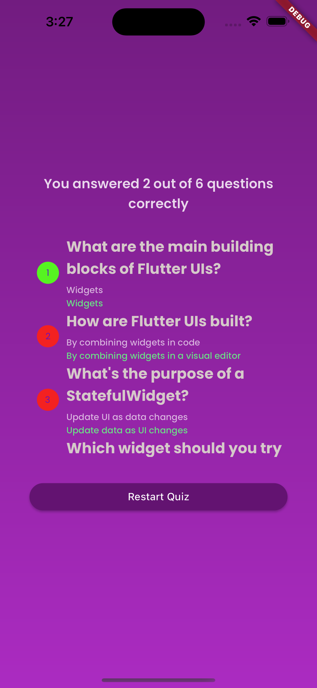

# Quiz

> A quiz app built with Flutter, focusing on topics related to Flutter development. This app provides users with an interactive way to test their knowledge and understanding of Flutter concepts and features.

## Table of Contents

- [Tech Stack](#TechStack)
- [Description](#description)
- [Screenshot](#Screenshot)
- [Features](#features)
- [Installation](#installation)
- [Usage](#usage)

## TechStack

-The Flutter Quiz App is built entirely using Flutter, a popular UI toolkit for building natively compiled applications for mobile, web, and desktop from a single codebase. By leveraging the Flutter framework, the app achieves cross-platform compatibility and enables a seamless user experience on both Android and iOS devices.

## Description

- The Flutter Quiz App is a mobile application developed using Flutter framework. It is designed to help users test their knowledge of various Flutter topics. The app consists of three main pages: Start Page, Quiz Pages, and Result Page.

- Start Page: The Start Page displays an image and a "Start Test" button. Users can tap the button to begin the quiz.

- Quiz Pages: The Quiz Pages present a series of quiz questions based on Flutter topics. Each question is accompanied by multiple options, and users can select their answers by tapping on the desired option.

- Result Page: The Result Page shows the user's performance in the quiz. It includes the question index, represented by a color indicating whether the user's answer was correct or wrong. Additionally, it displays the actual question, the user's answer, and the correct answer for each question.

- The Flutter Quiz App provides an interactive and engaging way for Flutter enthusiasts to test their knowledge and - improve their understanding of Flutter concepts.

## Screenshots

## Features

- Interactive quiz based on Flutter topics.
- Multiple-choice questions with options.
- Start Page with a visually appealing image and a "Start Test" button.
- Quiz Pages that display questions and options.
- Result Page with question index, user answer, and correct answer for each question

## Installation

1. Clone or download the repository to your local machine.
2. Make sure you have Flutter and Dart SDK installed on your system.
3. Run flutter pub get to fetch the project dependencies.

## Usage

1. Connect your mobile device or start an emulator.
2. Run flutter run in the project directory to launch the app on your device/emulator.
3. Explore the Start Page and tap the "Start Test" button to begin the quiz.
4. On the Quiz Pages, read each question carefully and select your answer from the available options.
5. Proceed through the questions until you have completed the quiz.
6. After answering all the questions, the Result Page will display your performance, including the correct and incorrect answers..
